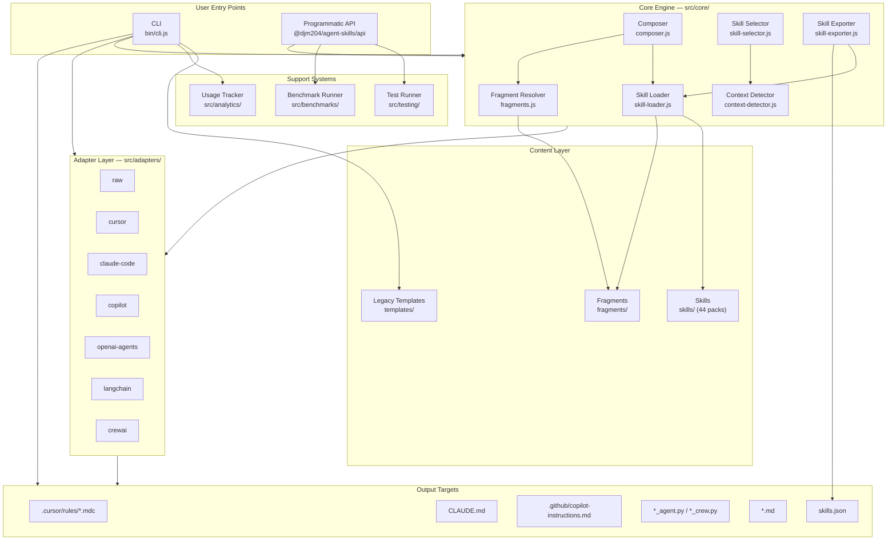
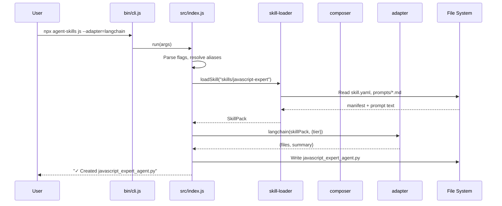
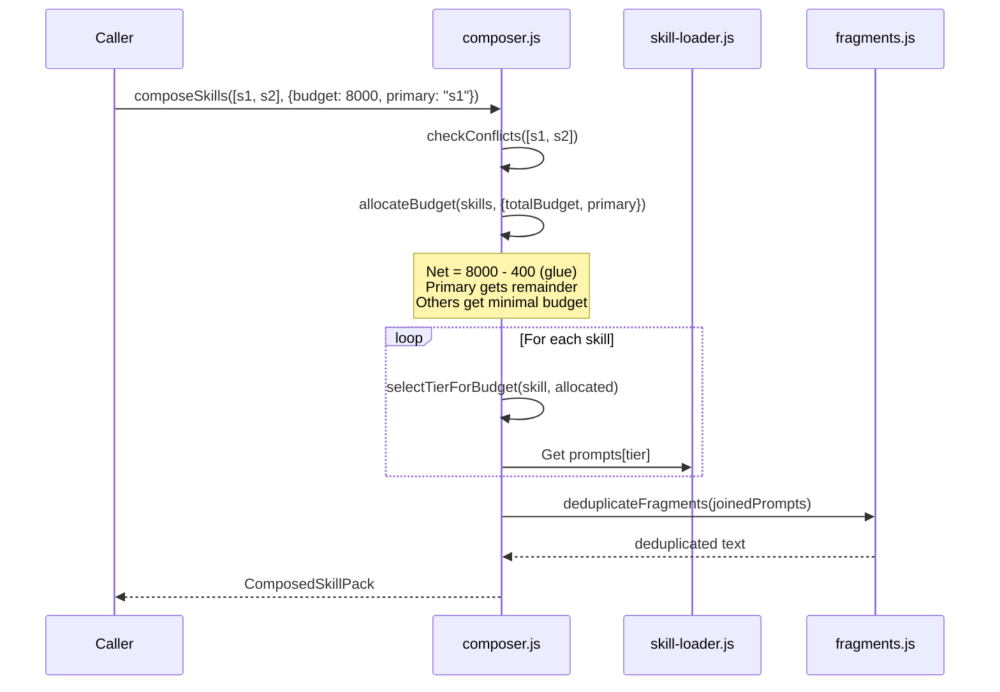
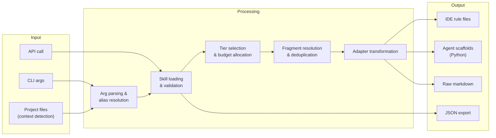
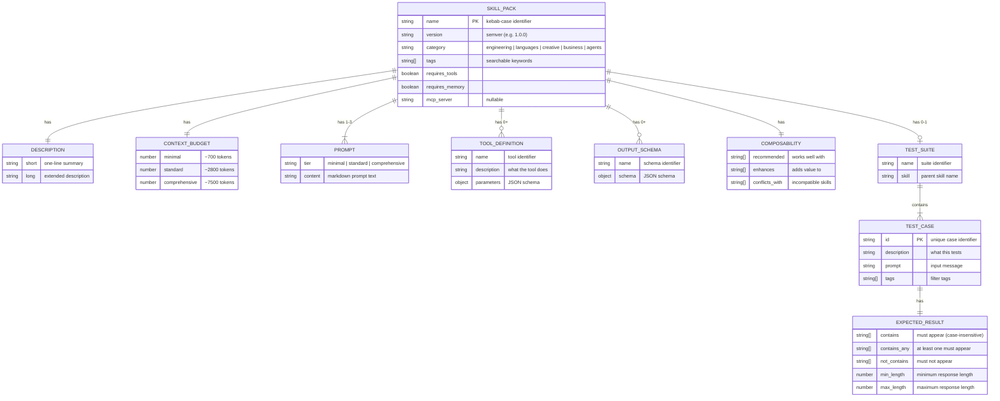
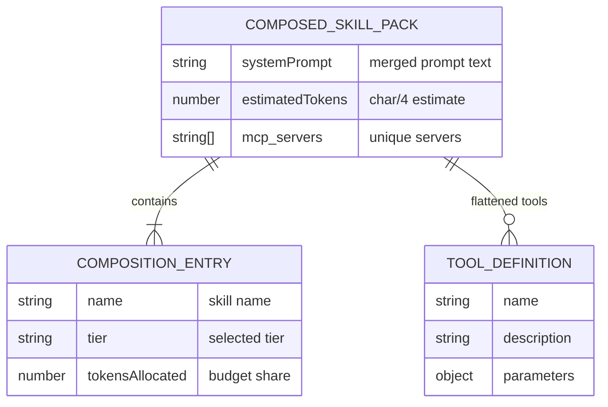
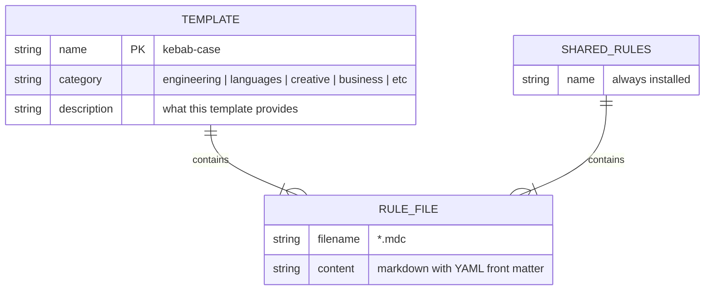
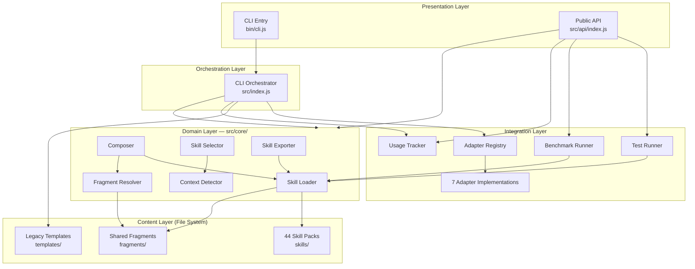
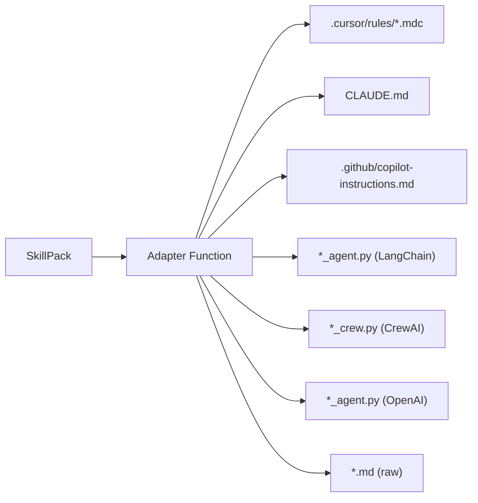
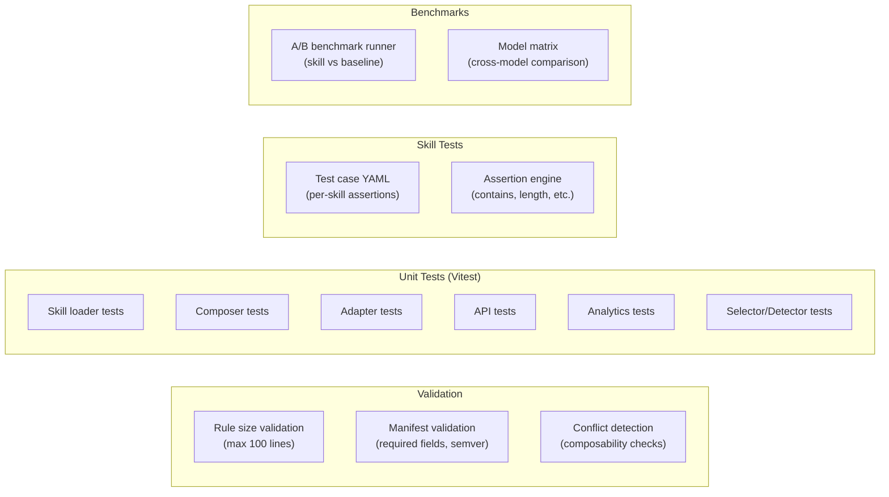

# Architecture — @djm204/agent-skills

> Universal skill framework: installable domain expertise for AI agents.
> Node.js ESM CLI + programmatic API. 44 skill packs, 7 adapters, tiered prompts.

---

## System Overview



---

## Component Interaction



### Skill Composition Flow



---

## Data Flow



---

## Entity-Relationship Diagrams

### Skill Pack Model



### Composed Skill Pack Model



### Template Model (Legacy)



---

## Directory Structure

```
@djm204/agent-skills/
├── bin/
│   └── cli.js                     # CLI entry point → calls src/index.js run()
├── src/
│   ├── index.js                   # CLI orchestrator (~1800 lines)
│   │                              #   - arg parsing, alias resolution
│   │                              #   - template registry auto-discovery
│   │                              #   - IDE file installation & smart merging
│   │                              #   - adapter pipeline invocation
│   ├── api/
│   │   └── index.js               # Public API (subpath: @djm204/agent-skills/api)
│   ├── core/
│   │   ├── skill-loader.js        # Load & validate skill packs
│   │   ├── composer.js            # Budget-aware skill composition
│   │   ├── fragments.js           # Shared prompt block resolution
│   │   ├── skill-selector.js      # Runtime skill selection (heuristic scoring)
│   │   ├── context-detector.js    # Project environment scanning
│   │   └── skill-exporter.js      # JSON export for skill metadata
│   ├── adapters/
│   │   ├── index.js               # Adapter registry (ADAPTERS, getAdapter)
│   │   ├── raw.js                 # Plain markdown
│   │   ├── cursor.js              # Cursor IDE .mdc files
│   │   ├── claude-code.js         # CLAUDE.md sections
│   │   ├── copilot.js             # .github/copilot-instructions.md
│   │   ├── openai-agents.js       # OpenAI Agents SDK (Python)
│   │   ├── langchain.js           # LangChain agent (Python)
│   │   └── crewai.js              # CrewAI agent (Python)
│   ├── analytics/
│   │   └── tracker.js             # Local usage tracking (JSON Lines)
│   ├── benchmarks/
│   │   ├── runner.js              # Skill A/B benchmark runner
│   │   └── model-matrix.js        # Cross-model comparison
│   └── testing/
│       └── test-runner.js         # Skill test suite loader & evaluator
├── skills/                        # 44 universal skill packs
│   └── <skill-name>/
│       ├── skill.yaml             # Manifest (name, version, category, budget, composability)
│       ├── prompts/
│       │   ├── minimal.md         # ~700 tokens
│       │   ├── standard.md        # ~2800 tokens
│       │   └── comprehensive.md   # ~7500 tokens
│       ├── tools/                 # Optional tool definitions
│       └── tests/                 # Optional test cases
├── templates/                     # Legacy template format
│   ├── _shared/                   # Shared rules (always installed)
│   │   └── .cursor/rules/*.mdc
│   └── <category>/<name>/
│       ├── template.yaml
│       └── .cursor/rules/*.mdc
├── fragments/                     # Shared prompt fragments
│   ├── citation-standards.md
│   ├── confidentiality.md
│   ├── ethical-guidelines.md
│   └── output-format.md
├── shim/                          # Deprecated package redirect (agentic-team-templates)
├── scripts/
│   ├── validate-rule-sizes.js     # Enforce max 100 lines per rule
│   ├── dogfood.js                 # Self-test installer
│   └── run-model-matrix.js        # Benchmark orchestrator
└── docs/
    ├── ARCHITECTURE.md            # This document
    ├── adrs/                      # Architecture Decision Records
    └── *.md                       # Guides and references
```

---

## Layer Architecture



---

## Key Algorithms

### Budget Allocation

The composer allocates token budgets across skills to fit a total context window:

```
COMPOSITION_GLUE_TOKENS = 400 (separator overhead)
Net budget = totalBudget - 400

If primary skill specified:
  1. Each non-primary skill gets its minimal tier budget
  2. Primary skill gets: net budget - sum(non-primary minimal budgets)

If no primary:
  1. Split net budget evenly across all skills
```

### Tier Selection

For a given token budget, select the highest-quality tier that fits:

```
Try comprehensive → standard → minimal (highest first)
Pick the highest tier whose context_budget[tier] ≤ allocated tokens
```

### Tier Fallback (Loading)

When a requested tier's prompt file is missing:

```
Requested minimal  → try: standard, comprehensive
Requested standard → try: minimal, comprehensive
Requested comprehensive → try: standard, minimal
```

### Skill Selection Scoring (Runtime)

Heuristic scoring to auto-select skills for a given prompt + project context:

| Signal | Weight |
|--------|--------|
| Tag match | 3 |
| Description keyword match | 1 |
| Language match | 5 |
| Framework match | 5 |
| Composability bonus | 2 |

### Fragment Deduplication

Shared prompt blocks wrapped in HTML comments (`<!-- fragment:name -->...<!-- /fragment:name -->`) are deduplicated when composing multiple skills, preventing token waste.

---

## Adapter Interface

All adapters conform to a single contract:

```javascript
adapter(skillPack, { tier? }) → { files: Array<{ path, content }>, summary: string }
```



| Adapter | Output | Target |
|---------|--------|--------|
| `raw` | `<skill>.md` | Plain markdown |
| `cursor` | `.cursor/rules/<skill>.mdc` | Cursor IDE |
| `claude-code` | `CLAUDE.md` sections | Claude Code |
| `copilot` | `.github/copilot-instructions.md` | GitHub Copilot |
| `openai-agents` | `<skill>_agent.py` | OpenAI Agents SDK |
| `langchain` | `<skill>_agent.py` | LangChain |
| `crewai` | `<skill>_crew.py` | CrewAI |

---

## Skill Categories

44 skill packs organized across 5 categories:

| Category | Count | Examples |
|----------|-------|---------|
| Languages | 11 | javascript-expert, python-expert, rust-expert, golang-expert |
| Engineering | 11 | web-frontend, web-backend, devops-sre, cli-tools, testing |
| Creative | 5 | documentation, ux-designer, brand-guardian, content-creation-expert |
| Business | 9 | product-manager, project-manager, strategic-negotiator, executive-assistant |
| Agents/Other | 8 | ml-ai, data-engineering, educator, utility-agent |

Each skill contains three prompt tiers:

| Tier | Token Target | Purpose |
|------|-------------|---------|
| `minimal` | ~700 | Core identity — fits in tight context windows |
| `standard` | ~2,800 | Full behavioral prompt — recommended default |
| `comprehensive` | ~7,500 | Includes examples, edge cases — maximum quality |

---

## Testing & Quality



**Assertion types** (skill test cases):
- `contains` — all strings must appear (case-insensitive)
- `contains_any` — at least one string must appear
- `not_contains` — none may appear
- `min_length` / `max_length` — response length bounds

---

## Analytics (Privacy-First)

- **Storage**: `~/.agent-skills/usage.jsonl` (local, append-only JSON Lines)
- **Auto-disabled** in CI environments (`CI=true`, `GITHUB_ACTIONS=true`)
- **Opt-out**: `AGENT_SKILLS_NO_TRACKING=1`
- **No network calls** — all data stays local

---

## CLI Command Reference

```
npx @djm204/agent-skills <templates...> [options]

Installation:
  agent-skills web-frontend                    Install template rules
  agent-skills js --adapter=langchain          Install skill via adapter
  agent-skills js ts --adapter=raw --out=./    Multiple skills

Options:
  --list                    List available templates & skills
  --help                    Show help
  --version                 Show version
  --dry-run                 Preview changes without writing
  --force                   Overwrite existing files
  --yes                     Skip confirmation prompts
  --ide=<ide>               Target IDE (cursor|claude|codex), repeatable
  --adapter=<name>          Use adapter (raw|cursor|claude-code|copilot|openai-agents|langchain|crewai)
  --tier=<tier>             Prompt tier (minimal|standard|comprehensive)
  --skill-dir=<dir>         Custom skills directory
  --out=<dir>               Output directory
  --remove <templates>      Uninstall template rules
  --reset                   Remove all installed rules
  --export                  Export skills as JSON
  --auto                    Auto-select skills based on project context
  --stats                   Show usage statistics
```

---

## Dependencies

| Dependency | Purpose | Type |
|-----------|---------|------|
| Node.js built-ins (fs, path, os, child_process) | File I/O, process management | Runtime |
| vitest | Test framework | Dev |
| husky | Git hooks | Dev |
| @commitlint/cli + config-conventional | Commit message validation | Dev |
| release-please | Automated releases | CI |
